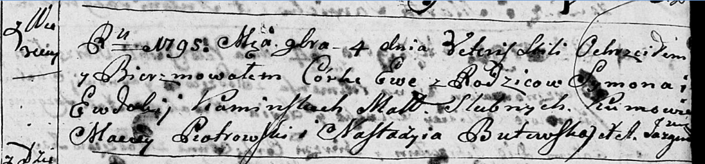
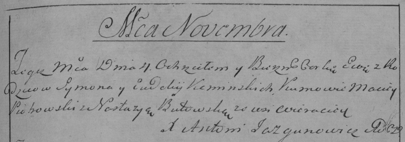

**Каминская Ева Сымонова (Kaminska Ewa)**

4 ноября 1795 г -- крещение (НИАБ 136-13-894, лист 26, №50/1795-р
(ориг)), (РГИА 823-2-18, лист 254, №39/1795-р (коп)).

**НИАБ 136-13-894:** Лист 26. **Метрическая запись №50/1795-р (ориг).**

Дедиловичская Покровская церковь. 4 ноября 1795 года. Метрическая запись
о крещении.

Kaminska Ewa -- дочь родителей с деревни Веретеи.

Kaminski Symon -- отец.

Kaminska Ewdokija -- мать.

Piotrowski Maciey - кум.

Butewska Nastazyia - кума.

Jazgunowicz Antoni -- ксёндз.

**РГИА 823-2-18:** Лист 254. **Метрическая запись №39/1795-р (коп).**

Дедиловичская Покровская церковь. 4 ноября 1795 года. Метрическая запись
о крещении.

Kaminska Ewa -- дочь родителей с деревни Веретей.

Kaminski Symon -- отец.

Kaminska Ewdokija -- мать.

Piotrowski Maciey -- кум.

Butowska Nastazya -- кума.

Jazgunowicz Antoni -- ксёндз.
