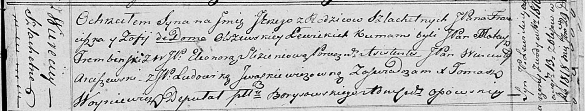

**Левицкий Юрий Францишков, шляхтич (Lewicki Jerzy)**

29 сентября 1818 г -- крещение (НИАБ 136-13-894, лист 99, №31/1818-р
(ориг)).

**НИАБ 136-13-894:** Лист 99. **Метрическая запись №31/1818-р (ориг).**

{width="6.496527777777778in"
height="1.2437871828521434in"}

Осовская Покровская церковь. 29 сентября 1818 года. Метрическая запись о
крещении.

Lewicki Jerzy, JP -- сын родителей с деревни Веретей, шляхтич.

Lewicki Franciszek, JP -- отец, шляхтич.

Lewizka z Olszewskich Zofija, JP -- мать.

Trembinski Mateusz, JP -- кум, шляхтич.

Slizieniowa Eleonora, WJP -- кума, шляхтянка.

Arciszewski Wincenty, JP -- ассистент, шляхтич.

Jwaszkewiczowna Ludowika, JP -- ассистентка, шляхтянка.

Woyniewicz Tomasz -- ксёндз.
