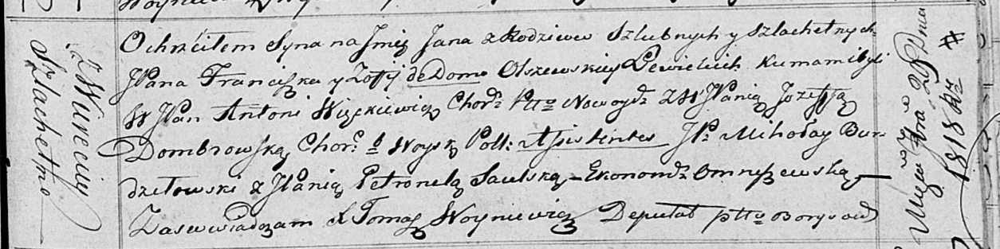

**Левицкий Ян Францишков, шляхтич (Lewicki Jan)**

29 сентября 1818 г -- крещение (НИАБ 136-13-894, лист 99, №32/1818-р
(ориг)).

**НИАБ 136-13-894:** Лист 99. **Метрическая запись №32/1818-р (ориг).**

Осовская Покровская церковь. 29 сентября 1818 года. Метрическая запись о
крещении.

Lewicki Jan, JP -- сын родителей с деревни Веретей, шляхтич.

Lewicki Franciszek, JP -- отец, шляхтич.

Lewizka z Olszewskich Zofija, JP -- мать, шляхтянка.

Węckiewicz Antoni, WJP -- кум, шляхтич.

Dombrowska Jozefata, WJP -- кума, шляхтянка.

Burdziłowski Mikołay, JP -- ассистент, шляхтич.

Saulska Petronela, JP -- ассистентка, шляхтянка, экономка Омнишевская.

Woyniewicz Tomasz -- ксёндз
