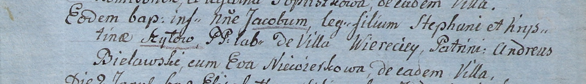

**Неверка Ева (Niewierkowa Eva)**

1 января 1805 г -- крестная мать Якоба, сына Степана и Хрыстыны Шил с
деревни Веретей (НИАБ 937-4-32, лист 11, №2/1805-р).

**НИАБ 937-4-32:** Лист 11. **Метрическая запись №2/1805-р.**

{width="6.496527777777778in"
height="0.9381944444444444in"}

Дедиловичский костел Наисвятейшего Сердца Иисуса. 1 января 1805 года.
Метрическая запись о крещении.

Szyło Jakob -- сын крестьян с деревни Веретей.

Shyło Stephan -- отец.

Szyłowa Krystina -- мать.

Bielawski Andreus -- крестный отец, с деревни Веретей.

Niewierkowa Eva -- крестная мать, с деревни Веретей.

Linhart Hiacinthus -- ксёндз.
