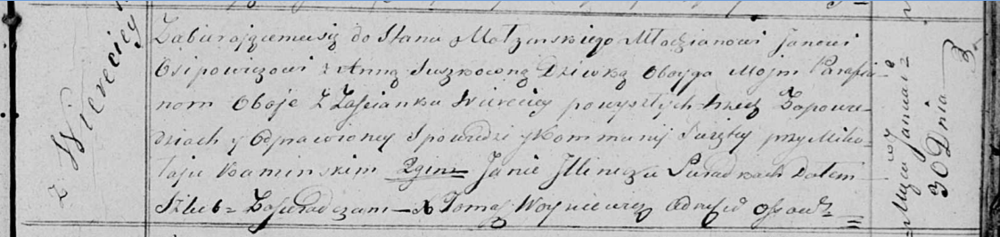
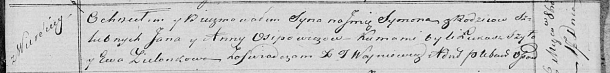

**Осипович Ян (Osipowicz Jan)**

30 января 1819 г -- венчание с девкой Анной Сушко с деревни Веретей
(НИАБ 136-13-920, лист 26, №3/1819-б (ориг)).

17 октября 1820 г -- крещение сына Сымона (НИАБ 136-13-894, лист 105,
№35/1820-р (ориг)).

**НИАБ 136-13-920:** Лист 26. **Метрическая запись №3/1819-б (ориг).**

Осовская Покровская церковь. 30 января 1819 года. Запись о венчании.

Osipowicz Jan -- жених, молодой, парафии Осовской, с застенка Веретей.

Suszkowna Anna -- невеста, девка, парафии Осовской, с застенка Веретей.

Kaminski Mikołay -- свидетель.

Jllinicz Jan -- свидетель.

Woyniewicz Tomasz -- ксёндз.

**НИАБ 136-13-894:** Лист 105. **Метрическая запись №35/1820-р (ориг).**

Осовская Покровская церковь. 17 октября 1820 года. Метрическая запись о
крещении.

Osipowicz Symon -- сын родителей с деревни Веретей.

Osipowicz Jan -- отец.

Osipowiczowna Anna -- мать.

Szyło Łukasz -- кум.

Zielonkowa Ewa -- кума.

Woyniewicz Tomasz -- ксёндз.
