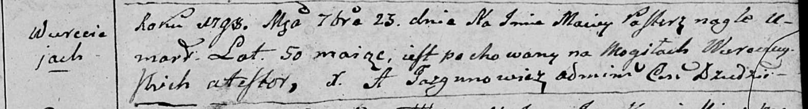

**Пастеж Мацей (Pasterz Maciey)**

23 сентября 1790 г -- отпевание, умер в возрасте 50 лет (родился около
1748 г) (НИАБ 136-13-919, лист 8, №17/1798-у (ориг)).

**НИАБ 136-13-919:** Лист 8. **Метрическая запись №17/1798-у (ориг).**

Дедиловичская Покровская церковь. 23 сентября 1798 года. Метрическая
запись об отпевании.

Pasterz Maciey -- умерший, 50 лет, с деревни Веретей, похоронен на
кладбище деревни Веретей.

Jazgunowicz Antoni -- ксёндз.
