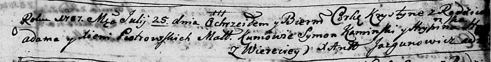

**Петровская Хрыстына Адамова (Pietrowska Krystyna)**

25 июля 1787 г -- крещение (НИАБ 136-13-894, лист 2, №32/1787-р (ориг)).

**НИАБ 136-13-894:** Лист 2. **Метрическая запись №32/1787-р (ориг).**

Дедиловичская Покровская церковь. 25 июля 1787 года. Метрическая запись
о крещении.

Pietrowska Krystyna -- дочь родителей с деревни Веретеи.

Pietrowski Adam -- отец.

Pietrowska Xienia -- мать.

Kaminski Symon -- кум.

H? Hrypina - кума.

Jazgunowicz Antoniusz -- ксёндз.
