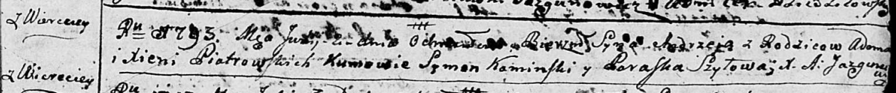
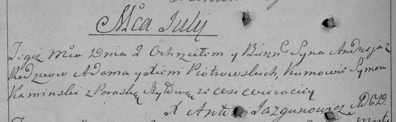

**Петровский Андрей Адамов (Pietrowski Andrzey)**

2 июля 1793 г -- крещение сына Андрея (НИАБ 136-13-894, лист 20,
№52/1793-р (ориг)), (РГИА 823-2-18, лист 247об, №26/1793-р (коп)).

**НИАБ 136-13-894:** Лист 20. **Метрическая запись №52/1793-р (ориг).**

Дедиловичская Покровская церковь. 2 июля 1793 года. Метрическая запись о
крещении.

Piatrowski Andrzey -- сын родителей с деревни Веретей.

Piatrowski Adam -- отец.

Piatrowska Xienia -- мать.

Kaminski Symon - кум.

Szyłowa Paraska - кума.

Jazgunowicz Antoni -- ксёндз.

**РГИА 823-2-18:** Лист 247об. **Метрическая запись №26/1793-р (коп).**

Дедиловичская Покровская церковь. 2 июля 1793 года. Метрическая запись о
крещении.

Piotrowski Andrzey -- сын родителей с деревни Веретей.

Piotrowski Adam -- отец.

Piotrowska Xienia -- мать.

Kaminski Symon -- кум.

Szyłowa Paraska -- кума.

Jazgunowicz Antoni -- ксёндз.
