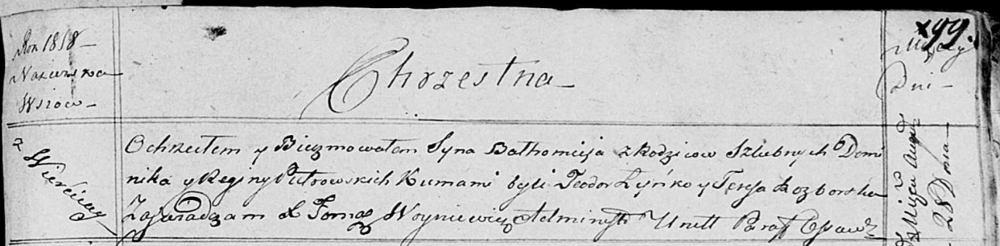

**Петровский Балтромей Домиников (Pietrowski Bałtromiey)**

28 августа 1818 г -- крещение (НИАБ 136-13-894, лист 99, №27/1818-р
(ориг)).

**НИАБ 136-13-894:** Лист 99. **Метрическая запись №27/1818-р (ориг).**

{width="6.496527777777778in"
height="1.6004965004374454in"}

Осовская Покровская церковь. 28 августа 1818 года. Метрическая запись о
крещении.

Pietrowski Bałtromey -- сын родителей с деревни Веретей.

Pietrowki Dominik -- отец.

Pietrowska Regina -- мать.

Łyńko Teodor -- кум.

Razborska Teresa -- кума.

Woyniewicz Tomasz -- ксёндз.
