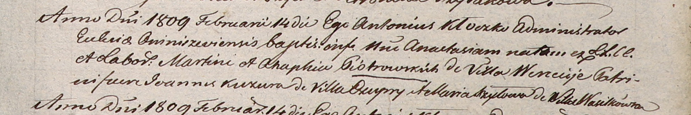
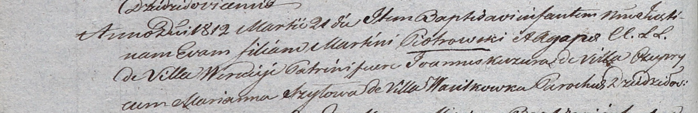

**Петровский Мартин (Piotrowski Martin)**

14 февраля 1809 г -- крещение дочери Анастасии (НИАБ 937-4-32, лист 19,
№6/1809-р).

21 марта 1812 г -- крещение дочери Евы (НИАБ 937-4-32, лист 24об,
№12/1812-р).

**НИАБ 937-4-32:** Лист 19. **Метрическая запись №6/1809-р.**

Дедиловичский костел Наисвятейшего Сердца Иисуса. 14 февраля 1809 года.
Метрическая запись о крещении.

Piotrowska Anastasia -- дочь крестьян с деревни Веретей.

Piotrowski Martin -- отец.

Piotroska Ahaphia -- мать.

Kuzura Joann -- крестный отец, с деревни Чупры.

Szyłowa Maria -- крестная мать, с деревни Васильковка.

Kłoczko Antonius -- ксёндз, администратор Ошмянский.

**НИАБ 937-4-32:** Лист 24об. **Метрическая запись №12/1812-р.**

Дедиловичский костел Наисвятейшего Сердца Иисуса. 21 марта 1812 года.
Метрическая запись о крещении.

Piotrowska Eva -- дочь родителей с деревни Веретей.

Piotrowski Martin -- отец.

Piotrowska Agapa -- мать.

Kuzura Joann -- крестный отец, с деревни Чупры.

Szyłowa Marianna -- крестная мать, с деревни Васильковка.

Kłoczko Antonius -- ксёндз, администратор Омнишевский.
