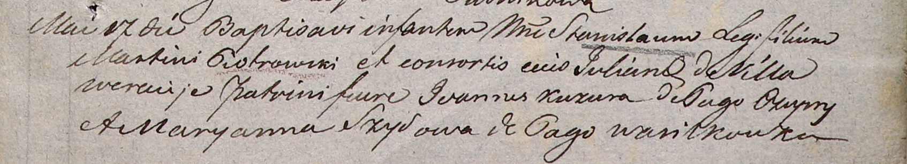

**Петровская Юльяна (Piotrowska Juliana)**

17 мая 1806 г -- крещение сына Станислава (НИАБ 937-4-32, лист 13,
№10/1806-р).

**НИАБ 937-4-32:** Лист 13. **Метрическая запись №10/1806-р.**

Дедиловичский костел Наисвятейшего Сердца Иисуса. 17 мая 1806 года.
Метрическая запись о крещении.

Piotrowski Stanisław -- сын родителей с деревни Веретей.

Piotrowski Martin -- отец.

Piotrowska Juliana -- мать.

Kuzura Jvanius -- крестный отец, с деревни Чупры.

Szyłowa Maryanna -- крестная мать, с деревни Васильковка.

Linhart Hiacinthus -- ксёндз.
