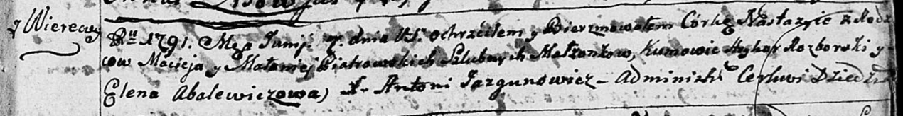
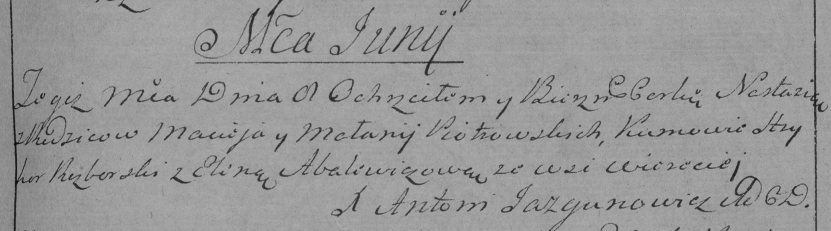

**Петровская Настасья Мацеева (Piotrowska Nastazyia)**

8 июня 1791 г -- крещение (НИАБ 136-13-894, лист 13, №23/1791-р (ориг)),
(РГИА 823-2-18, лист 242, №12/1791-р (коп)).

**НИАБ 136-13-894:** Лист 13. **Метрическая запись №23/1791-р (ориг).**

Дедиловичская Покровская церковь. 8 июня 1791 года. Метрическая запись о
крещении.

Piotrowska Nastazyia -- дочь родителей с деревни Веретеи.

Piotrowski Maciej -- отец.

Piotrowska Małanija -- мать.

Rozborski Hryhor - кум.

Abalewiczowa Elena - кума.

Jazgunowicz Antoni -- ксёндз.

**РГИА 823-2-18:** Лист 242. **Метрическая запись №12/1791-р (коп).**

Дедиловичская Покровская церковь. 8 июня 1791 года. Метрическая запись о
крещении.

Piotrowska Nastazia -- дочь родителей с деревни Веретей.

Piotrowski Maciey -- отец.

Piotrowska Małanija -- мать.

Rozborski Hryhor -- кум.

Abalewiczowa Elena - кума.

Jazgunowicz Antoni -- ксёндз.
