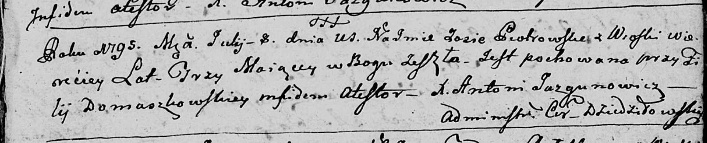

**Петровская Юстына Мацеева (Piotrowska Justyna)**

29 марта 1798 г -- крещение (НИАБ 136-13-894, лист 35об, №11/1798-р
(ориг)), (РГИА 823-2-18, лист 262об, №11/1798-р (коп)).

**НИАБ 136-13-894:** Лист 35-об. **Метрическая запись №11.**

{width="6.496527777777778in"
height="0.6510608048993876in"}

Дедиловичская Покровская церковь. 29 марта 1798 года. Метрическая запись
о крещении.

Piotrowska Justyna -- дочь родителей с деревни Веретей.

Piotrowski Maciey -- отец.

Piotrowska Mełanija -- мать.

Rozborski Hryhor - кум.

Awłaskowa Aryna - кума.

Jazgunowicz Antoni -- ксёндз.

**РГИА 823-2-18:** Лист 262об. **Метрическая запись №11/1798-р (коп).**

{width="6.496527777777778in"
height="1.4493055555555556in"}

Дедиловичская Покровская церковь. 29 марта 1798 года. Метрическая запись
о крещении.

\[Pietrowska Justyna\] -- дочь родителей с деревни Веретей.

Pietrowski Maciey -- отец.

Pietrowska Małania -- мать.

Rozborski Hryhor -- кум.

Awłaskowa Aryna -- кума.

Jazgunowicz Antoni -- ксёндз.
