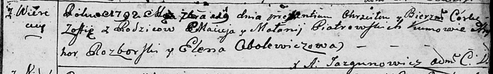

**Петровский Мацей (Piotrowski Maciej)**

8 июня 1791 г -- крещение дочери Настасьи (НИАБ 136-13-894, лист 13,
№23/1791-р (ориг)), (РГИА 823-2-18, лист 242, №12/1791-р (коп)).

29 сентября 1792 г -- крещение дочери Софии (НИАБ 136-13-894, лист 17,
№57/1792-р (ориг)), (РГИА 823-2-18, лист 245, №26/1792-р (коп)).

23 декабря 1795 г -- крещение сына Данилы (НИАБ 136-13-894, лист 27,
№64/1795-р (ориг)), (РГИА 823-2-18, лист 254, №47/1795-р (коп)).

29 марта 1798 г -- крещение дочери Юстыны (НИАБ 136-13-894, лист 35об,
№11/1798-р (ориг)), (РГИА 823-2-18, лист 262об, №11/1798-р (коп)).

**НИАБ 136-13-894:** Лист 13. **Метрическая запись №23/1791-р (ориг).**

{width="6.496527777777778in"
height="0.8388024934383203in"}

Дедиловичская Покровская церковь. 8 июня 1791 года. Метрическая запись о
крещении.

Piotrowska Nastazyia -- дочь родителей с деревни Веретеи.

Piotrowski Maciej -- отец.

Piotrowska Małanija -- мать.

Rozborski Hryhor - кум.

Abalewiczowa Elena - кума.

Jazgunowicz Antoni -- ксёндз.

**РГИА 823-2-18:** Лист 242. **Метрическая запись №12/1791-р (коп).**

{width="6.496527777777778in"
height="1.8055555555555556in"}

Дедиловичская Покровская церковь. 8 июня 1791 года. Метрическая запись о
крещении.

Piotrowska Nastazia -- дочь родителей с деревни Веретей.

Piotrowski Maciey -- отец.

Piotrowska Małanija -- мать.

Rozborski Hryhor -- кум.

Abalewiczowa Elena - кума.

Jazgunowicz Antoni -- ксёндз.

**НИАБ 136-13-894:** Лист 17. **Метрическая запись №57/1792-р (ориг).**

{width="6.496527777777778in"
height="0.988996062992126in"}

Дедиловичская Покровская церковь. 29 сентября 1792 года. Метрическая
запись о крещении.

Piatrowska Zofija -- дочь родителей с деревни Веретей.

Piatrowski Maciey -- отец.

Piatrowska Małanija -- мать.

Rozborski Hryhor - кум.

Obolewiczowa Elena - кума.

Jazgunowicz Antoni -- ксёндз.

**РГИА 823-2-18:** Лист 245. **Метрическая запись №26/1792-р (коп).**

{width="6.496527777777778in"
height="1.6847222222222222in"}

Дедиловичская Покровская церковь. 19 сентября 1792 года. Метрическая
запись о крещении.

Pietrowska Zofia -- дочь родителей с деревни Веретей.

Pietrowski Maciey -- отец.

Pietrowska Małannia -- мать.

Rozborski Hryhor -- кум.

Obolewiczowa Elena -- кума.

Jazgunowicz Antoni -- ксёндз.

**НИАБ 136-13-894:** Лист 27. **Метрическая запись №64/1795-р (ориг).**

{width="6.496527777777778in"
height="0.8388024934383203in"}

Дедиловичская Покровская церковь. 23 декабря 1795 года. Метрическая
запись о крещении.

Piatrowski Daniła -- сын родителей с деревни Веретеи.

Piatrowski Maciey -- отец.

Piatrowska Małanija -- мать.

Rozborski Hryhor - кум.

Awłaskowa Jryna - кума.

Jazgunowicz Antoni -- ксёндз.

**РГИА 823-2-18:** Лист 254об. **Метрическая запись №47/1795-р (коп).**

{width="6.496527777777778in"
height="1.7506944444444446in"}

Дедиловичская Покровская церковь. 23 декабря 1795 года. Метрическая
запись о крещении.

Piatrowski Daniel -- сын родителей с деревни Веретей.

Piatrowski Maciey -- отец.

Piatrowska Małania -- мать.

Rozborski Hryhor -- кум.

Awłaskowa Jryna -- кума.

Jazgunowicz Antoni -- ксёндз.

**НИАБ 136-13-894:** Лист 35-об. **Метрическая запись №11.**

{width="6.496527777777778in"
height="0.6510608048993876in"}

Дедиловичская Покровская церковь. 29 марта 1798 года. Метрическая запись
о крещении.

Piotrowska Justyna -- дочь родителей с деревни Веретей.

Piotrowski Maciey -- отец.

Piotrowska Mełanija -- мать.

Rozborski Hryhor - кум.

Awłaskowa Aryna - кума.

Jazgunowicz Antoni -- ксёндз.

**РГИА 823-2-18:** Лист 262об. **Метрическая запись №11/1798-р (коп).**

{width="6.496527777777778in"
height="1.4493055555555556in"}

Дедиловичская Покровская церковь. 29 марта 1798 года. Метрическая запись
о крещении.

\[Pietrowska Justyna\] -- дочь родителей с деревни Веретей.

Pietrowski Maciey -- отец.

Pietrowska Małania -- мать.

Rozborski Hryhor -- кум.

Awłaskowa Aryna -- кума.

Jazgunowicz Antoni -- ксёндз.
