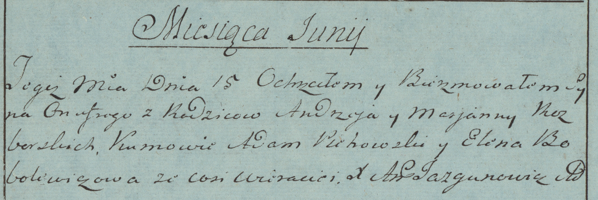

**Разборский Андрей (Rozborski Andrzey)**

15 июня 1783 г -- крещение сына Онуфрия (РГИА 823-2-18, лист 224об,
№15/1783-р (коп)).

**РГИА 823-2-18:** Лист 224об. **Метрическая запись №15/1783-р (коп).**

{width="6.496527777777778in"
height="2.182638888888889in"}

Дедиловичская Покровская церковь. 15 июня 1783 года. Метрическая запись
о крещении.

Rozborski Onufry -- сын родителей с деревни Веретеи.

Rozborski Andrzey -- отец.

Rozborska Marjanna -- мать.

Pichowski? Adam -- кум.

Bobolewiczowa Elena - кума.

Jazgunowicz Antoni -- ксёндз.
