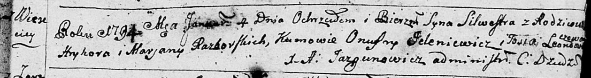
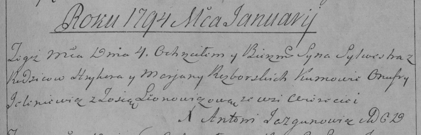
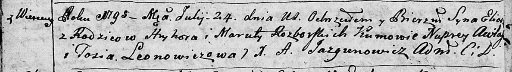
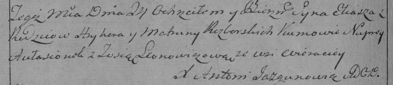
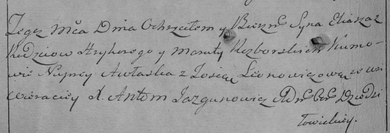

**Разборский Грыгор (Razborski Hryhor)**

4 января 1794 г -- крещение сына Сильвестра (НИАБ 136-13-894, лист 21,
№1/1794-р (ориг)), (РГИА 823-2-18, лист 249, №1/1794-р (коп)).

24 июля 1795 г -- крещение сына Ильи (НИАБ 136-13-894, лист 24об,
№22/1795-р (ориг)), (РГИА 823-2-18, лист 252об, №18/1795-р (коп)), (РГИА
823-2-18, лист 252об, №20а/1795-р (коп)).

**НИАБ 136-13-894:** Лист 21. **Метрическая запись №1/1794-р (ориг).**

Дедиловичская Покровская церковь. 4 января 1794 года. Метрическая запись
о крещении.

Razborski Silwestr -- сын родителей с деревни Веретеи.

Razborski Hryhor -- отец.

Razborska Marjana-- мать.

Jelenewicz Onufry - кум.

Leonowiczewa Tosia - кума.

Jazgunowicz Antoni -- ксёндз.

**РГИА 823-2-18:** Лист 249. **Метрическая запись №1/1794-р (коп).**

Дедиловичская Покровская церковь. 4 января 1794 года. Метрическая запись
о крещении.

Razborski Sylwester -- сын родителей с деревни Веретей.

Razborski Hryhor -- отец.

Razborska Marjana -- мать.

\[Jelene\]wicz Onufry -- кум.

Leonowiczowa Zosia -- кума.

Jazgunowicz Antoni -- ксёндз.

**НИАБ 136-13-894:** Лист 24об. **Метрическая запись №22/1795-р
(ориг).**

Дедиловичская Покровская церковь. 24 июля 1795 года. Метрическая запись
о крещении.

Rozborski Eliasz-- сын родителей с деревни Веретеи.

Rozborski Hryhor -- отец.

Rozborska Maruta -- мать.

Awłasko Nuprey - кум.

Leonowiczowa Tosia - кума.

Jazgunowicz Antoni -- ксёндз.

**РГИА 823-2-18:** Лист 252об. **Метрическая запись №18/1795-р (коп).**

Дедиловичская Покровская церковь. 24 июля 1795 года. Метрическая запись
о крещении.

Rozborski Eliasz -- сын родителей с деревни Веретей.

Rozborski Hryhor -- отец.

Rozborska Matruna -- мать.

Aułasionok Nuprey -- кум.

Leonowiczowa Zosia -- кума.

Jazgunowicz Antoni -- ксёндз.

**РГИА 823-2-18:** Лист 252об. **Метрическая запись №20а/1795-р (коп).**
(копия записи №18 выше)

Дедиловичская Покровская церковь. \[29\] июля 1795 года. Метрическая
запись о крещении.

Razborski Eliasz -- сын родителей с деревни Веретей.

Razborski Hryhory -- отец.

Razborska Maruta -- мать.

Awłaska Nuprey -- кум.

Leonowiczowa Zosia -- кума.

Jazgunowicz Antoni -- ксёндз.
