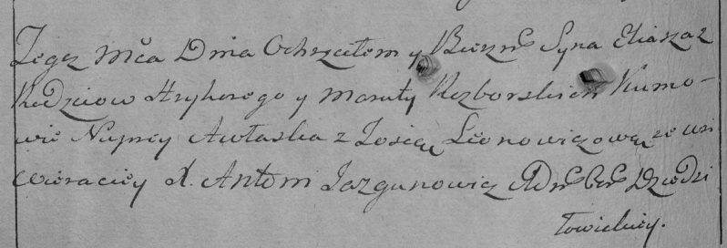

**Разборский Сильвестр Грыгоров (Razborski Silwestr)**

4 января 1794 г -- крещение (НИАБ 136-13-894, лист 21, №1/1794-р
(ориг)), (РГИА 823-2-18, лист 249, №1/1794-р (коп)).

**НИАБ 136-13-894:** Лист 21. **Метрическая запись №1/1794-р (ориг).**

{width="6.496527777777778in"
height="0.8669641294838145in"}

Дедиловичская Покровская церковь. 4 января 1794 года. Метрическая запись
о крещении.

Razborski Silwestr -- сын родителей с деревни Веретеи.

Razborski Hryhor -- отец.

Razborska Marjana-- мать.

Jelenewicz Onufry - кум.

Leonowiczewa Tosia - кума.

Jazgunowicz Antoni -- ксёндз.

**РГИА 823-2-18:** Лист 249. **Метрическая запись №1/1794-р (коп).**

{width="6.496527777777778in"
height="2.0944444444444446in"}

Дедиловичская Покровская церковь. 4 января 1794 года. Метрическая запись
о крещении.

Razborski Sylwester -- сын родителей с деревни Веретей.

Razborski Hryhor -- отец.

Razborska Marjana -- мать.

\[Jelene\]wicz Onufry -- кум.

Leonowiczowa Zosia -- кума.

Jazgunowicz Antoni -- ксёндз.
