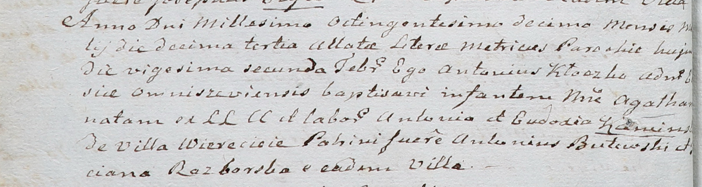

**Разборская Татьяна (Rozborska Taciana)**

22 февраля 1810 г -- крестная мать Агаты, дочери Антония и Евдокии
Каминских с деревни Веретей (НИАБ 136-13-894, лист 21об, №12/1810-р).

**НИАБ 937-4-32:** Лист 21об. **Метрическая запись №12/1810-р.**

{width="6.496527777777778in"
height="1.7402777777777778in"}

Дедиловичский костел Наисвятейшего Сердца Иисуса. 22 февраля 1810 года.
Метрическая запись о крещении.

Kaminska Agatha -- дочь родителей с деревни Веретей.

Kaminski Antoni -- отец.

Kaminska Eudoxia -- мать.

Butewski Antoni -- крестный отец.

Rozborska Taciana -- крестная мать, с деревни Веретей.

Kłoczko Antonius -- ксёндз, администратор Ошмянский.
