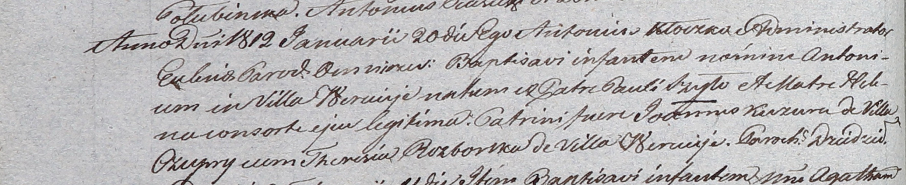

**Разборская Тереза (Rozborska Theresia)**

20 января 1812 г -- крестная мать Антона, сына Павла и Елены Шил с
деревни Веретей (НИАБ 937-4-32, лист 24об, №10/1812-р).

**НИАБ 937-4-32:** Лист 24об. **Метрическая запись №10/1812-р.**

{width="6.496527777777778in"
height="1.3277777777777777in"}

Дедиловичский костел Наисвятейшего Сердца Иисуса. 20 января 1812 года.
Метрическая запись о крещении.

Szyło Antoni -- сын родителей с деревни Веретей.

Szyło Paul -- отец.

Szyłowa Helena -- мать.

Kuzura Joann -- крестный отец, с деревни Чупры.

Rozborska Theresia -- крестная мать, с деревни Веретей.

Kłoczko Antonius -- ксёндз, администратор Омнишевский.
