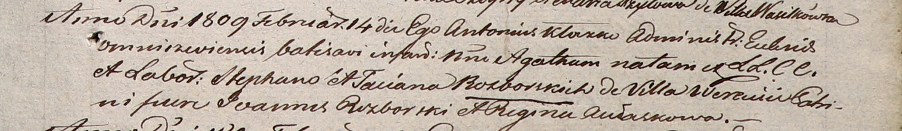

**Разборская Агата Стефанова (Rozborska Agatha)**

14 февраля 1809 г -- крещение (НИАБ 937-4-32, лист 19, №7/1809-р).

**НИАБ 937-4-32:** Лист 19. **Метрическая запись №7/1809-р.**

Дедиловичский костел Наисвятейшего Сердца Иисуса. 14 февраля 1809 года.
Метрическая запись о крещении.

Rozborska Agatha -- дочь крестьян с деревни Веретей.

Rozborski Stephan -- отец.

Rozborska Taciana -- мать.

Rozborski Joann -- крестный отец.

Aułaskowa Regina -- крестная мать.

Kłoczko Antonius -- ксёндз, администратор Ошмянский.
