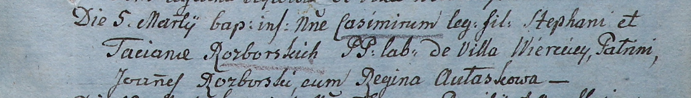
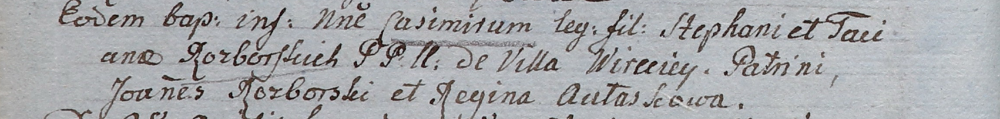

**Разборская Татьяна (Rozborska Taciana)**

5 марта 1805 г -- крещение сына Казимира (НИАБ 937-4-32, лист 11,
№9/1805-р).

10 апреля 1805 г -- крещение сына Казимира (НИАБ 937-4-32, лист 11,
№19/1805-р).

27 декабря 1806 г -- крещение дочери Евы (НИАБ 937-4-32, лист 14об,
№27/1806-р).

14 февраля 1807 г -- крестная мать Аплонии, дочери Антония и Евдокии
Каминских с деревни Веретей (НИАБ 136-13-894, лист 15, №5/1807-р).

14 февраля 1809 г -- крещение дочери Агаты (НИАБ 937-4-32, лист 19,
№7/1809-р).

**НИАБ 136-13-894:** Лист 11. **Метрическая запись №9/1805-р.**

Дедиловичский костел Наисвятейшего Сердца Иисуса. 5 марта 1805 года.
Метрическая запись о крещении.

Rozborski Casimir -- сын крестьян с деревни Веретей.

Rozborski Stephan -- отец.

Rozborska Taciana -- мать.

Rozborski Joann -- крестный отец.

Aułaskowa Regina -- крестная мать.

Linhart Hiacinthus -- ксёндз.

**НИАБ 937-4-32:** Лист 11об. **Метрическая запись №19/1805-р.**

Дедиловичский костел Наисвятейшего Сердца Иисуса. 10 апреля 1805 года.
Метрическая запись о крещении.

Rozborski Casimir -- сын родителей с деревни Веретей.

Rozborski Stephan -- отец.

Rozborska Taciana -- мать.

Rozborski Joann -- крестный отец.

Aułaskowa Regina -- крестная мать.

Linhart Hiacinthus -- ксёндз.

**НИАБ 937-4-32:** Лист 14об. **Метрическая запись №27/1806-р.**

Дедиловичский костел Наисвятейшего Сердца Иисуса. 27 декабря 1806 года.
Метрическая запись о крещении.

Rozborska Eva -- дочь родителей с деревни Веретей.

Rozborski Stephan -- отец.

Rozborska Taciana -- мать.

Rozborski Jakob -- крестный отец, с деревни Веретей.

Aułaskowa Regina -- крестная мать, с деревни Веретей.

Kłoczko Antonius -- ксёндз, администратор костела Омнишевского.

**НИАБ 937-4-32:** Лист 15. **Метрическая запись №5/1807-р.**

Дедиловичский костел Наисвятейшего Сердца Иисуса. 14 февраля 1807 года.
Метрическая запись о крещении.

Kaminska Apołonia -- дочь родителей с деревни Веретей.

Kaminski Antoni -- отец.

Kaminska Audocia -- мать.

Butewski Antoni -- крестный отец, с деревни Веретей.

Rozborska Taciana -- крестная мать, с деревни Веретей.

Kłoczko Antonius -- ксёндз, администратор костела Омнишевского.

**НИАБ 937-4-32:** Лист 19. **Метрическая запись №7/1809-р.**

Дедиловичский костел Наисвятейшего Сердца Иисуса. 14 февраля 1809 года.
Метрическая запись о крещении.

Rozborska Agatha -- дочь крестьян с деревни Веретей.

Rozborski Stephan -- отец.

Rozborska Taciana -- мать.

Rozborski Joann -- крестный отец.

Aułaskowa Regina -- крестная мать.

Kłoczko Antonius -- ксёндз, администратор Ошмянский.
