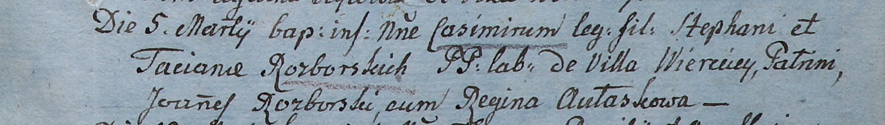
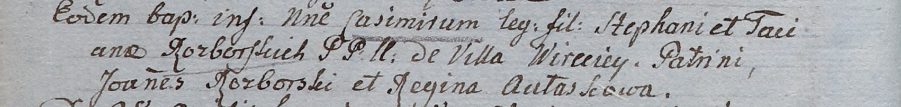
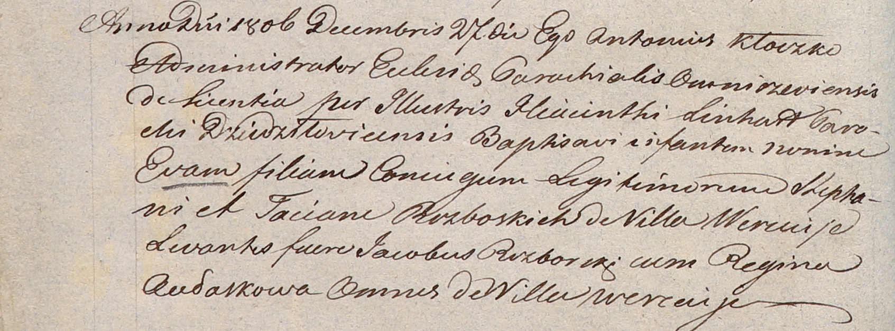
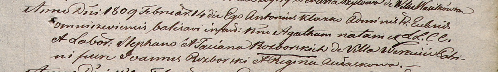
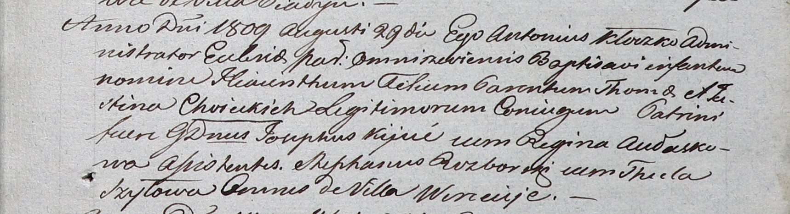

**Разборский Стефан (Rozborski Stephan)**

5 марта 1805 г -- крещение сына Казимира (НИАБ 937-4-32, лист 11,
№9/1805-р).

10 апреля 1805 г -- крещение сына Казимира (НИАБ 937-4-32, лист 11,
№19/1805-р).

27 декабря 1806 г -- крещение дочери Евы (НИАБ 937-4-32, лист 14об,
№27/1806-р).

26 мая 1808 г -- крестный отец Цецылии, дочери Елисея и Евдокии Авласков
с деревни Веретей (НИАБ 937-4-32, лист 18об, №17/1808-р).

14 февраля 1809 г -- крещение дочери Агаты (НИАБ 937-4-32, лист 19,
№7/1809-р).

29 августа 1809 г -- ассистент при крещении Гиацинта Феликса, сына
Томаша и Юстины Хоецких с деревни Веретей (НИАБ 937-4-32, лист 20,
№26/1809-р).

**НИАБ 937-4-32:** Лист 11. **Метрическая запись №9/1805-р.**

Дедиловичский костел Наисвятейшего Сердца Иисуса. 5 марта 1805 года.
Метрическая запись о крещении.

Rozborski Casimir -- сын крестьян с деревни Веретей.

Rozborski Stephan -- отец.

Rozborska Taciana -- мать.

Rozborski Joann -- крестный отец.

Aułaskowa Regina -- крестная мать.

Linhart Hiacinthus -- ксёндз.

**НИАБ 937-4-32:** Лист 11об. **Метрическая запись №19/1805-р.**

Дедиловичский костел Наисвятейшего Сердца Иисуса. 10 апреля 1805 года.
Метрическая запись о крещении.

Rozborski Casimir -- сын родителей с деревни Веретей.

Rozborski Stephan -- отец.

Rozborska Taciana -- мать.

Rozborski Joann -- крестный отец.

Aułaskowa Regina -- крестная мать.

Linhart Hiacinthus -- ксёндз.

**НИАБ 937-4-32:** Лист 14об. **Метрическая запись №27/1806-р.**

Дедиловичский костел Наисвятейшего Сердца Иисуса. 27 декабря 1806 года.
Метрическая запись о крещении.

Rozborska Eva -- дочь родителей с деревни Веретей.

Rozborski Stephan -- отец.

Rozborska Taciana -- мать.

Rozborski Jakob -- крестный отец, с деревни Веретей.

Aułaskowa Regina -- крестная мать, с деревни Веретей.

Kłoczko Antonius -- ксёндз, администратор костела Омнишевского.

**НИАБ 937-4-32:** Лист 18об. **Метрическая запись №17/1808-р.**

Дедиловичский костел Наисвятейшего Сердца Иисуса. 26 мая 1808 года.
Метрическая запись о крещении.

Aułaskowna Cecilia -- дочь крестьян с деревни Веретей.

Aułasko Alexander -- отец.

Aułaskowa Eudokia -- мать.

Rozborski Stephan -- крестный отец, с деревни Веретей.

Butewska Anna -- крестная мать, с деревни Веретей.

Zychowski Gabriel -- ксёндз.

**НИАБ 937-4-32:** Лист 19. **Метрическая запись №7/1809-р.**

Дедиловичский костел Наисвятейшего Сердца Иисуса. 14 февраля 1809 года.
Метрическая запись о крещении.

Rozborska Agatha -- дочь крестьян с деревни Веретей.

Rozborski Stephan -- отец.

Rozborska Taciana -- мать.

Rozborski Joann -- крестный отец.

Aułaskowa Regina -- крестная мать.

Kłoczko Antonius -- ксёндз, администратор Ошмянский.

**НИАБ 937-4-32:** Лист 20. **Метрическая запись №26/1809-р.**

Дедиловичский костел Наисвятейшего Сердца Иисуса. 29 августа 1809 года.
Метрическая запись о крещении.

Choiecki Hiacinthus Felix -- сын родителей с деревни Веретей.

Choiecki Thoma -- отец.

Choiecka Justina -- мать.

Kijuc Josephus -- крестный отец, шляхтич, с деревни Веретей.

Aułaskowa Regina -- крестная мать, с деревни Веретей.

Rozborski Stephan - ассистент, с деревни Веретей.

Szyłowa Thecla - ассистентка, с деревни Веретей.

Kłoczko Antonius -- ксёндз, администратор Ошмянский.
