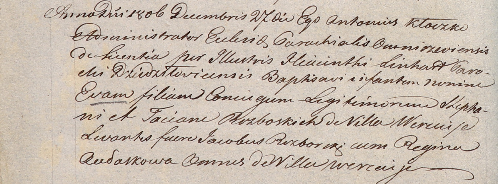

**Разборский Гаврыла Якубов (Rozborski Hauryła)**

28 апреля 1793 г -- крещение (НИАБ 136-13-894, лист 19об, №46/1793-р
(ориг)).

**НИАБ 136-13-894:** Лист 19-об. **Метрическая запись №46/1793-р
(ориг).**

{width="6.496527777777778in"
height="0.6235706474190726in"}

Дедиловичская Покровская церковь. 28 апреля 1793 года. Метрическая
запись о крещении.

Rozborski Hauryła -- сын родителей с деревни Веретеи.

Rozborski Jakub -- отец.

Rozborska Taćiana -- мать.

Szustowski Chwiedor - кум.

Kaminska Ewdokija - кума.

Jazgunowicz Antoni -- ксёндз.
