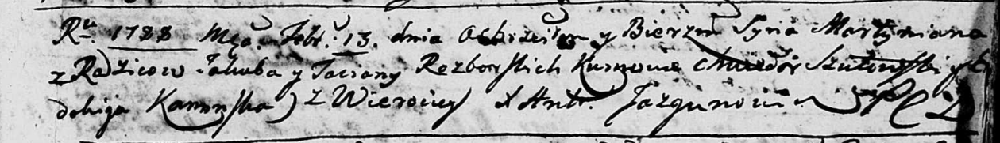
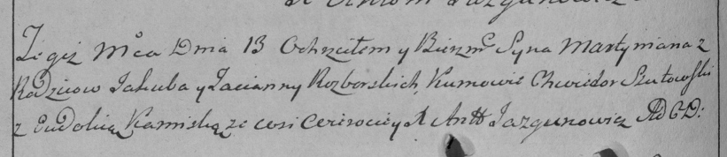

**Разборский Мартымьян Якубов (Rozborski Martymian)**

13 февраля 1788 г -- крещение сына Мартымьяна (НИАБ 136-13-894, лист 4,
№17/1788-р (ориг)), (РГИА 823-2-18, лист 235об, №6/1788-р (коп)).

**НИАБ 136-13-894:** Лист 4. **Метрическая запись №17/1788-р (ориг).**

Дедиловичская Покровская церковь. 13 февраля 1788 года. Метрическая
запись о крещении.

Rozborski Martymian -- сын родителей с деревни Веретеи.

Rozborski Jakub -- отец.

Rozborska Taciana -- мать.

Szutowski Chwiedor - кум.

Kaminska Ewdokija - кума.

Jazgunowicz Antoniusz -- ксёндз.

**РГИА 823-2-18:** Лист 235об. **Метрическая запись №6/1788-р (коп).**

Дедиловичская Покровская церковь. 13 февраля 1788 года. Метрическая
запись о крещении.

Rozborski Martymjan -- сын родителей с деревни Веретей.

Rozborski Jakub -- отец.

Rozborska Tacianna -- мать.

Szutowski Chwiedor -- кум.

Kaminska Eudokia - кума.

Jazgunowicz Antoni -- ксёндз.
