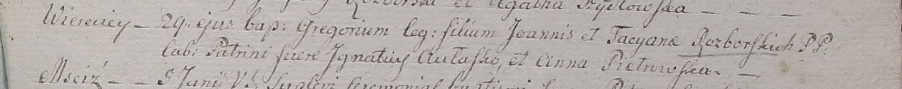

**Разборская Татьяна (Rozborska Tacyana)**

29 мая 1799 г -- крещение сына Грегора (НИАБ 1781-27-199, лист 128,
№27/1799-р).

**НИАБ 1781-27-199:** Лист 128. **Метрическая запись №27/1799-р.**

{width="6.496527777777778in"
height="0.65in"}

Дедиловичский костел Наисвятейшего Сердца Иисуса. 29 мая 1799 года.
Метрическая запись о крещении.

Rozborski Gregori -- сын крестьян с деревни Веретей.

Rozborski Joannis -- отец.

Rozborska Tacyana -- мать.

Aułasko Jgnatiusz -- крестный отец.

Pietrowska Anna -- крестная мать.

Linhart Hyacinthus -- ксёндз.
