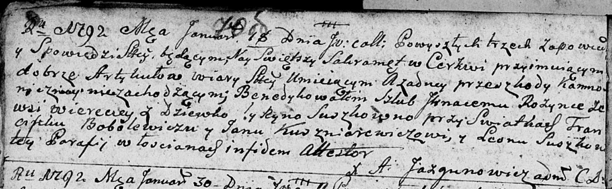

**Розынко Игнацы (Rozynko Jhnacy)**

18 января 1792 г -- венчаніе с Рыной Сушко (НИАБ 136-13-894, лист 70об,
№2/1792-б (ориг)).

**НИАБ 136-13-894:** Лист 70об. **Метрическая запись №2/1792-б (ориг).**

Дедиловичская Покровская церковь. 18 января 1792 года. Метрическая
запись о венчании.

Rozynka Jgnacy -- жених, с деревни Веретей.

Suszkowna Ryna -- невеста.

Bobolewicz Franciszka -- свидетель.

Kuszniarewicz Jan -- свидетель.

Suszko Leon -- свидетель.

Jazgunowicz Antoni -- ксёндз.
