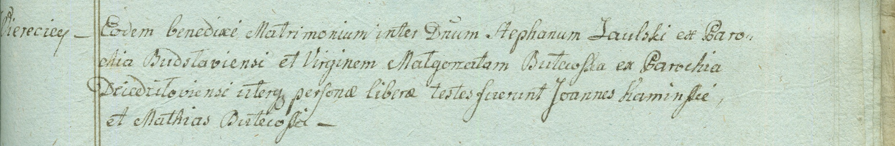

**Саульский Стефан (Saulski Stephan)**

31 октября 1798 г -- венчание с шляхтянкой девицей Малгожатой Бутевской
с деревни Веретей (НИАБ 1781-27-199, лист 124, №5/1798-б).

**НИАБ 1781-27-199:** Лист 124. **Метрическая запись №5/1798-б.**

{width="6.496527777777778in"
height="1.0645833333333334in"}

Дедиловичский костел Наисвятейшего Сердца Иисуса. 31 октября 1798 года.
Метрическая запись о венчании.

Saulski Stephan -- жених, шляхтич, парафии Будславской.

Butewska Małgorzata -- невеста, шляхтянка, девица, парафии
Дедиловичской, с деревни Веретей.

Kaminski Joann -- свидетель.

Butewski Mathius -- свидетель.

Linhart Hyacinthus -- ксёндз.
