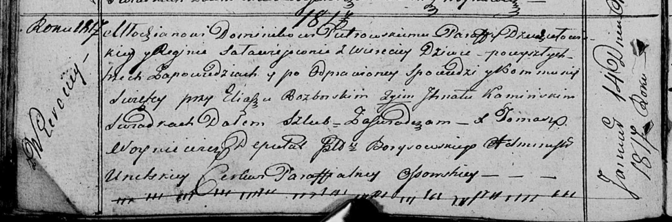

**Петровская (в девичестве Соловей) Регина (Pietrowska Regina z
Sаłаwiejow)**

14 января 1817 г -- венчание с молодым Домиником Петровским с деревни
Веретей (НИАБ 136-13-920, лист 23об, №1/1817-б (ориг)).

**НИАБ 136-13-920:** Лист 23об. **Метрическая запись №1/1817-б (ориг).**

{width="6.496527777777778in"
height="2.1523228346456693in"}

Осовская Покровская церковь. 14 января 1817 года. Запись о венчании.

Pietrowski Dominik -- жених, молодой, парафии Дедиловичской
католической, с деревни Веретей.

Saławiejowna Regina -- невеста, девка, парафии Осовской, с деревни
Веретей.

Rozborski Eliasz -- свидетель.

Kaminski Jgnat -- свидетель.

Woyniewicz Tomasz -- ксёндз.
