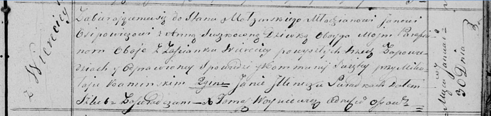

**Осипович (в девичестве Сушко) Анна (Osipowiczowa Anna z Suszkow)**

30 января 1819 г -- венчание с молодым Яном Осиповичем с деревни Веретей
(НИАБ 136-13-920, лист 26, №3/1819-б (ориг)).

**НИАБ 136-13-920:** Лист 26. **Метрическая запись №3/1819-б (ориг).**

{width="6.496527777777778in"
height="1.546185476815398in"}

Осовская Покровская церковь. 30 января 1819 года. Запись о венчании.

Osipowicz Jan -- жених, молодой, парафии Осовской, с застенка Веретей.

Suszkowna Anna -- невеста, девка, парафии Осовской, с застенка Веретей.

Kaminski Mikołay -- свидетель.

Jllinicz Jan -- свидетель.

Woyniewicz Tomasz -- ксёндз.
