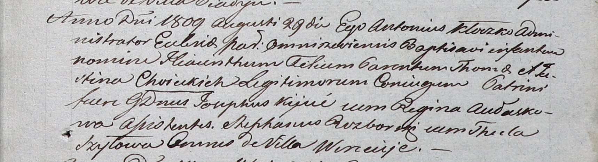

**Хоецкий Томаш (Choiecki Thoma)**

29 августа 1809 г -- крещение сына Гиацинта Феликса (НИАБ 937-4-32, лист
20, №26/1809-р).

**НИАБ 937-4-32:** Лист 20. **Метрическая запись №26/1809-р.**

{width="6.496527777777778in"
height="1.7659722222222223in"}

Дедиловичский костел Наисвятейшего Сердца Иисуса. 29 августа 1809 года.
Метрическая запись о крещении.

Choiecki Hiacinthus Felix -- сын родителей с деревни Веретей.

Choiecki Thoma -- отец.

Choiecka Justina -- мать.

Kijuc Josephus -- крестный отец, шляхтич, с деревни Веретей.

Aułaskowa Regina -- крестная мать, с деревни Веретей.

Rozborski Stephan - ассистент, с деревни Веретей.

Szyłowa Thecla - ассистентка, с деревни Веретей.

Kłoczko Antonius -- ксёндз, администратор Ошмянский.
