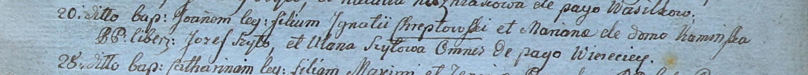

**Хрептовская (в девичестве Каминская) Марьяна (Chreptowska Mariana z
Kaminskich)**

20 марта 1800 г -- крещение сына Иоанна (НИАБ 937-4-32, лист 1,
№7/1800-р).

**НИАБ 937-4-32:** Лист 1. **Метрическая запись №7/1800-р.**

Дедиловичский костел Наисвятейшего Сердца Иисуса. 20 марта 1800 года.
Метрическая запись о крещении.

Chreptowski Joann -- сын вольных людей с деревни Веретей.

Chreptowski Jgnati -- отец.

Chreptowska Mariana z Kaminskich -- мать.

Szyło Jozef -- крестный отец, с деревни Веретей.

Szyłowa Ullana -- крестная мать, с деревни Веретей.

Linhart Hyacinthus -- ксёндз.
