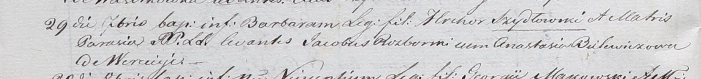

**Шидловская Барбара Грегорова (Szydłowska Barbara)**

29 сентября 1801 г -- крещение (НИАБ 937-4-32, лист 4об, №20/1801-р).

**НИАБ 136-13-920:** Лист 4об. **Метрическая запись №20/1801-р.**

Дедиловичский костел Наисвятейшего Сердца Иисуса. 29 сентября 1801 года.
Метрическая запись о крещении.

Szydłowska Barbara -- дочь родителей с деревни Веретей.

Szydłowski Hrehor -- отец.

Szydłowska Parasia -- мать.

Rozborski Jakob -- крестный отец.

Bulewiczowa? Anastasia -- крестная мать.

Linhart Hyacinthus -- ксёндз.
