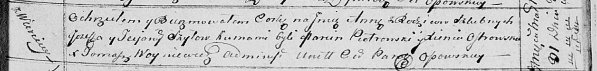

**Шило Иосиф (Szyło Jozef)**

20 марта 1800 г -- крестный отец Иоанна, сына Игнатия и Марьяны
Хрептовских с деревни Веретей (НИАБ 937-4-32, лист 1, №7/1800-р).

31 марта 1814 г -- крещение дочери Анны (НИАБ 136-13-894, лист 89,
№22/1814-р (ориг)).

**НИАБ 937-4-32:** Лист 1. **Метрическая запись №7/1800-р.**

{width="6.496527777777778in"
height="0.6111111111111112in"}

Дедиловичский костел Наисвятейшего Сердца Иисуса. 20 марта 1800 года.
Метрическая запись о крещении.

Chreptowski Joann -- сын вольных людей с деревни Веретей.

Chreptowski Jgnati -- отец.

Chreptowska Mariana z Kaminskich -- мать.

Szyło Jozef -- крестный отец, с деревни Веретей.

Szyłowa Ullana -- крестная мать, с деревни Веретей.

Linhart Hyacinthus -- ксёндз.

**НИАБ 136-13-894:** Лист 89. **Метрическая запись №22/1814-р (ориг).**

{width="6.496527777777778in"
height="0.7811384514435695in"}

Осовская Покровская церковь. 31 марта 1814 года. Метрическая запись о
крещении.

Szyłowna Anna -- дочь родителей с деревни Веретей.

Szyło Jozef -- отец.

Szyłowa Taciana -- мать.

Piotrowski Marcin -- кум.

Ostrowska Xienia -- кума.

Woyniewicz Tomasz -- ксёндз.
