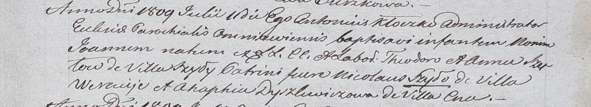

**Шило Николай (Szyło Nicołai)**

9 марта 1799 г -- крещение дочери Елены (НИАБ 1781-27-199, лист 125,
№20/1799-р).

11 июля 1809 г -- крестный отец Иоанна, сына Тодора и Анны Шил с деревни
Шилы (НИАБ 937-4-32, лист 20, №22/1809-р).

**НИАБ 1781-27-199:** Лист 125об. **Метрическая запись №20/1799-р.**

{width="6.496527777777778in"
height="0.6784722222222223in"}

Дедиловичский костел Наисвятейшего Сердца Иисуса. 9 марта 1799 года.
Метрическая запись о крещении.

Szyłowna Helena -- дочь крестьян с деревни Веретей.

Szyło Nicołai -- отец.

Szyłowa Chwiedora -- мать.

Szustowski Chwiedor -- крестный отец.

Szyłowa Rosalia - крестная мать.

Linhart Hyacinthus -- ксёндз.

**НИАБ 937-4-32:** Лист 20. **Метрическая запись №22/1809-р.**

{width="6.496527777777778in"
height="1.1819444444444445in"}

Дедиловичский костел Наисвятейшего Сердца Иисуса. 11 июля 1809 года.
Метрическая запись о крещении.

Szyło Joann -- сын крестьян с деревни Шилы.

Szyło Theodor -- отец.

Szyłowa Anna -- мать.

Szyło Nikołay -- крестный отец, с деревни Веретей.

Dyszlewiczowa Ahaphia -- крестная мать, с деревни Цна.

Kłoczko Antonius -- ксёндз, администратор Ошмянский.
