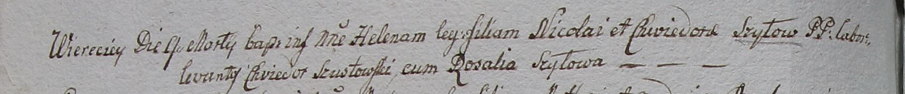

**Шило Хведора (Szyłowa Chwiedora)**

9 марта 1799 г -- крещение дочери Елены (НИАБ 1781-27-199, лист 125,
№20/1799-р).

**НИАБ 1781-27-199:** Лист 125об. **Метрическая запись №20/1799-р.**

Дедиловичский костел Наисвятейшего Сердца Иисуса. 9 марта 1799 года.
Метрическая запись о крещении.

Szyłowna Helena -- дочь крестьян с деревни Веретей.

Szyło Nicołai -- отец.

Szyłowa Chwiedora -- мать.

Szustowski Chwiedor -- крестный отец.

Szyłowa Rosalia - крестная мать.

Linhart Hyacinthus -- ксёндз.
