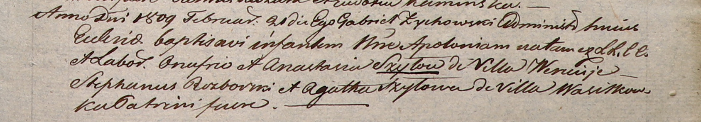

**Шило Аполония Онуфриева (Szyłowna Apołonia)**

21 февраля 1809 г -- крещение (НИАБ 937-4-32, лист 19, №9/1809-р).

**НИАБ 937-4-32:** Лист 19. **Метрическая запись №9/1809-р.**

Дедиловичский костел Наисвятейшего Сердца Иисуса. 21 февраля 1809 года.
Метрическая запись о крещении.

Szyłowna Apołonia -- дочь крестьян с деревни Веретей.

Szyło Onufrio -- отец.

Szyłowa Anastasia -- мать.

Rozborski Stephan -- крестный отец.

Szyłowa Agatha -- крестная мать, с деревни Васильковка.

Zychowski Gabriel -- ксёндз.
