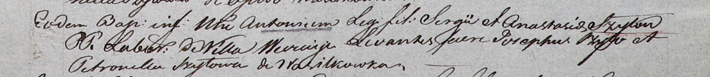

**Шило Сергей (Szyłło Sierhei, Sergi)**

30 января 1799 г -- венчание с Настой Шило (НИАБ 1781-27-199, лист 126,
№2/1799-б).

19 июня 1804 г -- крещение сына Антона (НИАБ 937-4-32, лист 10,
№14/1804-р).

12 марта 1805 -- крестный отец Томаша, сына Базиля и Анастасии Шил с
деревни Веретей (НИАБ 937-4-32, лист 11, №10/1805-р).

**НИАБ 1781-27-199:** Лист 126. **Метрическая запись №2/1799-б.**

Дедиловичский костел Наисвятейшего Сердца Иисуса. 30 января 1799 года.
Метрическая запись о венчании.

Szyłło Sierhei -- жених, с деревни Веретей.

Szyłłowna Nasta -- невеста.

Szyłło Joann -- свидетель.

Szyłło Hreor -- свидетель.

Linhart Hyacinthus -- ксёндз.

**НИАБ 937-4-32:** Лист 10. **Метрическая запись №14/1804-р.**

Дедиловичский костел Наисвятейшего Сердца Иисуса. 19 июня 1804 года.
Метрическая запись о крещении.

Szyło Antoni -- сын крестьян с деревни Веретей.

Szyło Sergi -- отец.

Szyłowa Anastasia -- мать.

Szyło Joseph -- крестный отец.

Szyłowa Petronella -- крестная мать, с деревни Васильковка.

Galinowski Joann -- ксёндз, комендант Дедиловичского костела.

**НИАБ 937-4-32:** Лист 11. **Метрическая запись №10/1805-р.**

Дедиловичский костел Наисвятейшего Сердца Иисуса. 12 марта 1805 года.
Метрическая запись о крещении.

Szyło Thomas -- сын родителей с деревни Веретей.

Szyło Basili -- отец.

Szyłowa Anastasia -- мать.

Szyło Sergius -- крестный отец, с деревни Веретей.

Szyłowa Ahapa -- крестная мать, с деревни Веретей.

Linhart Hiacinthus -- ксёндз.
