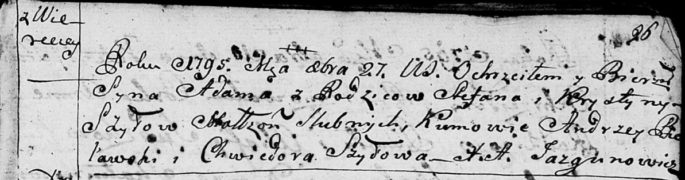
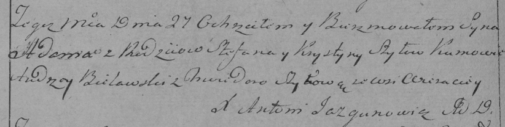

**Шило Адам Степанов (Szyło Adam)**

27 октября 1795 г -- крещение (НИАБ 136-13-894, лист 26, №46/1795-р
(ориг)), (РГИА 823-2-18, лист 253об, №34/1795-р (коп)).

**НИАБ 136-13-894:** Лист 26. **Метрическая запись №46/1795-р (ориг).**

Дедиловичская Покровская церковь. 27 октября 1795 года. Метрическая
запись о крещении.

Szyło Adam -- сын родителей с деревни Веретеи.

Szyło Stefan -- отец.

Szyłowa Krystyna -- мать.

Bielawski Andrzey - кум.

Szyłowa Chwiedora - кума.

Jazgunowicz Antoni -- ксёндз.

**РГИА 823-2-18:** Лист 253об. **Метрическая запись №34/1795-р (коп).**

Дедиловичская Покровская церковь. 27 октября 1795 года. Метрическая
запись о крещении.

Szyło Adam -- сын родителей с деревни Веретей.

Szyło Stefan -- отец.

Szyłowa Krystyna -- мать.

Bielawski Andrzey -- кум.

Szyłowa Chwiedora -- кума.

Jazgunowicz Antoni -- ксёндз.
