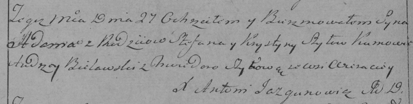

**Шило Степан (Szyło Stefan)**

3 ноября 1790 г -- венчание с Хрыстыной Церах (НИАБ 136-13-894, лист 69,
№12/1790-б (ориг)).

27 октября 1795 г -- крещение сына Адама (НИАБ 136-13-894, лист 26,
№46/1795-р (ориг)), (РГИА 823-2-18, лист 253об, №34/1795-р (коп)).

1 января 1805 г -- крещение сына Якоба (НИАБ 937-4-32, лист 11,
№2/1805-р).

**НИАБ 136-13-894:** Лист 69. **Метрическая запись №12/1790-б (ориг).**

Дедиловичская Покровская церковь. 3 ноября 1790 года. Метрическая запись
о венчании.

Szylo Stefan -- жених, с деревни Веретей.

Cierachowna Hrystyna -- невеста.

Piatrowski Adam -- свидетель.

Szyło Symon -- свидетель.

Cierach Ławryn -- свидетель.

Jazgunowicz Antoni -- ксёндз.

**НИАБ 136-13-894:** Лист 26. **Метрическая запись №46/1795-р (ориг).**

Дедиловичская Покровская церковь. 27 октября 1795 года. Метрическая
запись о крещении.

Szyło Adam -- сын родителей с деревни Веретеи.

Szyło Stefan -- отец.

Szyłowa Krystyna -- мать.

Bielawski Andrzey - кум.

Szyłowa Chwiedora - кума.

Jazgunowicz Antoni -- ксёндз.

**РГИА 823-2-18:** Лист 253об. **Метрическая запись №34/1795-р (коп).**

Дедиловичская Покровская церковь. 27 октября 1795 года. Метрическая
запись о крещении.

Szyło Adam -- сын родителей с деревни Веретей.

Szyło Stefan -- отец.

Szyłowa Krystyna -- мать.

Bielawski Andrzey -- кум.

Szyłowa Chwiedora -- кума.

Jazgunowicz Antoni -- ксёндз.

**НИАБ 937-4-32:** Лист 11. **Метрическая запись №2/1805-р.**

Дедиловичский костел Наисвятейшего Сердца Иисуса. 1 января 1805 года.
Метрическая запись о крещении.

Szyło Jakob -- сын крестьян с деревни Веретей.

Shyło Stephan -- отец.

Szyłowa Krystina -- мать.

Bielawski Andreus -- крестный отец, с деревни Веретей.

Niewierkowa Eva -- крестная мать, с деревни Веретей.

Linhart Hiacinthus -- ксёндз.
