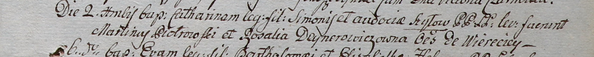

**Шило Катариына Сымонова (Szyłowna Catharina)**

2 декабря 1800 г -- крещение (НИАБ 937-4-32, лист 3, №38/1800-р).

**НИАБ 136-13-920:** Лист 3. **Метрическая запись №38/1800-р.**

Дедиловичский костел Наисвятейшего Сердца Иисуса. 2 декабря 1800 года.
Метрическая запись о крещении.

{width="6.496527777777778in"
height="0.6354166666666666in"}

Szyłowna Catharina -- дочь крестьян с деревни Веретей.

Szyło Simon -- отец.

Szyłowa Audocia -- мать.

Piotrowski Martin -- крестный отец, с деревни Веретей.

Deynerowiczowa Rosalia -- крестная мать, с деревни Веретей.

Linhart Hyacinthus -- ксёндз.
