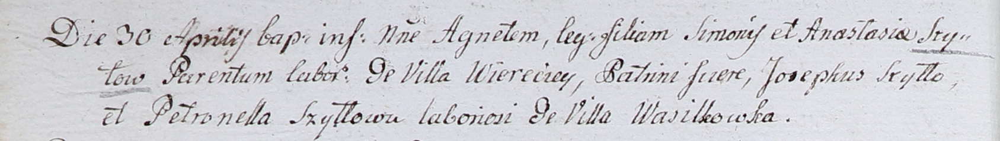

**Шило Анастасия (Szyłowa Anastasia)**

30 апреля 1802 г -- крещение дочери Агнеты (НИАБ 937-4-32, лист 6об,
№10/1802-р).

**НИАБ 937-4-32:** Лист 6об. **Метрическая запись №10/1802-р.**

{width="6.496527777777778in"
height="0.9166666666666666in"}

Дедиловичский костел Наисвятейшего Сердца Иисуса. 30 апреля 1802 года.
Метрическая запись о крещении.

Szyłowna Agneta -- дочь крестьян с деревни Веретей.

Szyło Simon -- отец.

Szyłowa Anastasia -- мать.

Szyłło Joseph -- крестный отец, крестьянин, с деревни Васильковка.

Szyłłowa Petronella -- крестная мать, крестьянин, с деревни Васильковка.

Linhart Hyacinthus -- ксёндз.
