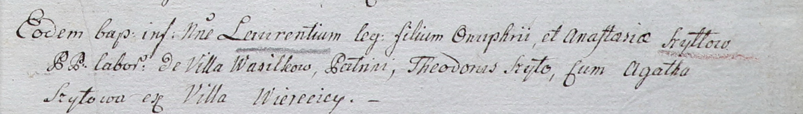

**Шило Тодор (Szyło Teodor)**

20 октября 1785 г -- крещение сына Дымитра (РГИА 823-2-18, лист 230,
№26/1785-р (коп)).

30 июля 1788 г -- крещение дочери Анны (НИАБ 136-13-894, лист 5,
№41/1788-р (ориг)).

17 сентября 1802 г -- крестный отец Лаврентия, сына Онуфрия и Анастасии
с деревни Васильковка (НИАБ 937-4-32, лист 7, №29/1802-р).

**РГИА 823-2-18:** Лист 230. **Метрическая запись №26/1785-р (коп).**

{width="6.496527777777778in"
height="2.354861111111111in"}

Дедиловичская Покровская церковь. 20 октября 1785 года. Метрическая
запись о крещении.

Szyło Dymitr -- сын родителей с деревни Веретей.

Szyło Teodor -- отец.

Szyłowa Uljana -- мать.

Szyło Symon -- кум.

Szyłowa Maruta - кума.

Jazgunowicz Antoni -- ксёндз.

**НИАБ 136-13-894:** Лист 5. **Метрическая запись №41/1788-р (ориг).**

{width="6.496527777777778in"
height="0.7388965441819773in"}

Дедиловичская Покровская церковь. 30 июля 1788 года. Метрическая запись
о крещении.

Szyłowna Anna -- дочь родителей с деревни Веретеи.

Szyło Teodor -- отец.

Szyłowa Ullana -- мать.

Szyło Symon - кум.

Szyłowa Marjana - кума.

Jazgunowicz Antoni -- ксёндз.

**НИАБ 937-4-32:** Лист 7. **Метрическая запись №29/1802-р.**

{width="6.496527777777778in"
height="0.9326388888888889in"}

Дедиловичский костел Наисвятейшего Сердца Иисуса. 17 сентября 1802 года.
Метрическая запись о крещении.

Szyłło Łaurenty -- сын крестьян с деревни Васильковка.

Szyłło Onuphry -- отец.

Szyłłowa Anastasia -- мать.

Szyło Theodor -- крестный отец, с деревни Веретей.

Szyłowa Agatha -- крестная мать, с деревни Веретей.

Linhart Hyacinthus -- ксёндз.
