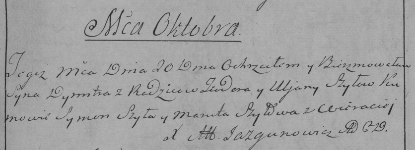
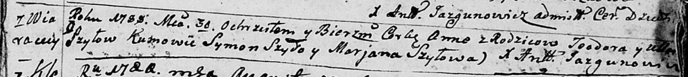
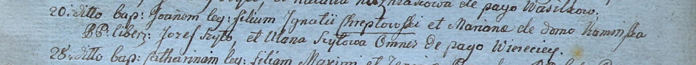

**Шило Ульяна (Szyłowa Uljana, Ullana)**

20 октября 1785 г -- крещение сына Дымитра (РГИА 823-2-18, лист 230,
№26/1785-р (коп)).

30 июля 1788 г -- крещение дочери Анны (НИАБ 136-13-894, лист 5,
№41/1788-р (ориг)).

20 марта 1800 г -- крестная мать Иоанна, сына Игнатия и Марьяны
Хрептовских с деревни Веретей (НИАБ 937-4-32, лист 1, №7/1800-р).

**РГИА 823-2-18:** Лист 230. **Метрическая запись №26/1785-р (коп).**

Дедиловичская Покровская церковь. 20 октября 1785 года. Метрическая
запись о крещении.

Szyło Dymitr -- сын родителей с деревни Веретей.

Szyło Teodor -- отец.

Szyłowa Uljana -- мать.

Szyło Symon -- кум.

Szyłowa Maruta - кума.

Jazgunowicz Antoni -- ксёндз.

**НИАБ 136-13-894:** Лист 5. **Метрическая запись №41/1788-р (ориг).**

Дедиловичская Покровская церковь. 30 июля 1788 года. Метрическая запись
о крещении.

Szyłowna Anna -- дочь родителей с деревни Веретеи.

Szyło Teodor -- отец.

Szyłowa Ullana -- мать.

Szyło Symon - кум.

Szyłowa Marjana - кума.

Jazgunowicz Antoni -- ксёндз.

**НИАБ 937-4-32:** Лист 1. **Метрическая запись №7/1800-р.**

Дедиловичский костел Наисвятейшего Сердца Иисуса. 20 марта 1800 года.
Метрическая запись о крещении.

Chreptowski Joann -- сын вольных людей с деревни Веретей.

Chreptowski Jgnati -- отец.

Chreptowska Mariana z Kaminskich -- мать.

Szyło Jozef -- крестный отец, с деревни Веретей.

Szyłowa Ullana -- крестная мать, с деревни Веретей.

Linhart Hyacinthus -- ксёндз.
