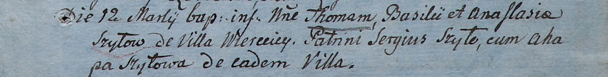

**Шило Агата (Szyłowa Agatha, Ahapa)**

17 сентября 1802 г -- крестная мать Лаврентия, сына Онуфрия и Анастасии
с деревни Васильковка (НИАБ 937-4-32, лист 7, №29/1802-р).

22 февраля 1805 года -- крестная мать Винцентия, сына Степана и Прузыны
Шил с деревни Шилы (НИАБ 937-4-32, лист 11, №8/1805-р).

12 марта 1805 -- крестная мать Томаша, сына Базиля и Анастасии Шил с
деревни Веретей (НИАБ 937-4-32, лист 11, №10/1805-р).

15 октября 1805 г -- крестная мать Михала, сына Игнатия и Регины
Авласков с деревни Веретей (НИАБ 937-4-32, лист 12, №37/1800-р).

**НИАБ 937-4-32:** Лист 7. **Метрическая запись №29/1802-р.**

{width="6.496527777777778in"
height="0.9326388888888889in"}

Дедиловичский костел Наисвятейшего Сердца Иисуса. 17 сентября 1802 года.
Метрическая запись о крещении.

Szyłło Łaurenty -- сын крестьян с деревни Васильковка.

Szyłło Onuphry -- отец.

Szyłłowa Anastasia -- мать.

Szyło Theodor -- крестный отец, с деревни Веретей.

Szyłowa Agatha -- крестная мать, с деревни Веретей.

Linhart Hyacinthus -- ксёндз.

**НИАБ 937-4-32:** Лист 11. **Метрическая запись №8/1805-р.**

{width="6.496527777777778in"
height="0.8833333333333333in"}

Дедиловичский костел Наисвятейшего Сердца Иисуса. 22 февраля 1805 года.
Метрическая запись о крещении.

Szyło Vincenti -- сын родителей с деревни Шилы.

Szyło Stephan -- отец.

Szyłowa Euphrosina -- мать.

Rozborski Stephan -- крестный отец.

Szyłowa Agatha -- крестная мать, с деревни Веретей.

Linhart Hiacinthus -- ксёндз.

**НИАБ 937-4-32:** Лист 11. **Метрическая запись №10/1805-р.**

{width="6.496527777777778in"
height="0.8326388888888889in"}

Дедиловичский костел Наисвятейшего Сердца Иисуса. 12 марта 1805 года.
Метрическая запись о крещении.

Szyło Thomas -- сын родителей с деревни Веретей.

Szyło Basili -- отец.

Szyłowa Anastasia -- мать.

Szyło Sergius -- крестный отец, с деревни Веретей.

Szyłowa Ahapa -- крестная мать, с деревни Веретей.

Linhart Hiacinthus -- ксёндз.

**НИАБ 937-4-32:** Лист 12. **Метрическая запись №37/1805-р.**

{width="6.496527777777778in"
height="0.9451388888888889in"}

Дедиловичский костел Наисвятейшего Сердца Иисуса. 15 октября 1805 года.
Метрическая запись о крещении.

Aułasko Michael -- сын крестьян с деревни Веретей.

Aułasko Jgnati -- отец.

Aułaskowa Regina -- мать.

Szyło Simon -- крестный отец.

Szyłowa Agatha -- крестная мать, с деревни Веретей.

Linhart Hiacinthus -- ксёндз.
