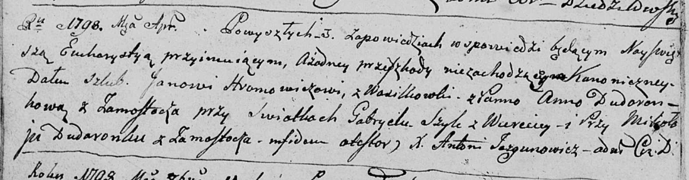

**Шило Габриэль (Szyło Gabriel)**

Апрель 1798 г -- свидетель венчания Яна Хромовича с деревни Васильковка
с Анной Дударёнок с деревни Замосточье (НИАБ 136-13-920, лист 5об,
№8/1798-б (ориг)).

**НИАБ 136-13-920:** Лист 5об. **Метрическая запись №8/1798-б (ориг).**

{width="6.496527777777778in"
height="1.7024136045494314in"}

Дедиловичская Покровская церковь. Апреля 1798 года. Метрическая запись о
венчании.

Hromowicz Jan -- жених, деревня Васильковка.

Dudaronkowa Anna -- невеста, деревня Замосточье.

Szyło Gabriel -- свидетель, деревня Веретей.

Dudaronek Mikołay -- свидетель, деревня Замосточье.

Jazgunowicz Antoni -- ксёндз.
