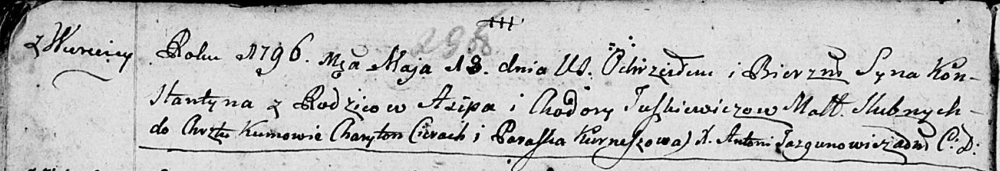

**Юшкевич Иосиф Асипов (Juszkiewicz Jozef)**

26 декабря 1802 г -- крещение (НИАБ 136-13-894, лист 49, №50/1802-р
(ориг)).

**НИАБ 136-13-894:** Лист 29-об. **Метрическая запись №52/1796-р
(ориг).**

Дедиловичская Покровская церковь. 18 мая 1796 года. Метрическая запись о
крещении.

Juszkiewicz Konstantyn -- сын родителей с деревни Веретеи.

Juszkiewicz Asip -- отец.

Juszkiewiczowa Chadora -- мать.

Cierach Charyton - кум.

Kurneszowa Paraska - кума.

Jazgunowicz Antoni -- ксёндз.
