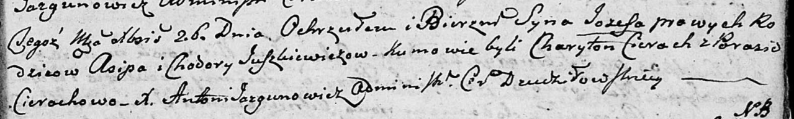

**Юшкевич Хадора (Juszkiewiczowa Chadora, Chodora)**

18 мая 1796 г -- крещение сына Константына (НИАБ 136-13-894, лист 29об,
№52/1796-р (ориг)), (РГИА 823-2-18, лист 256, №24/1796-р (коп)).

26 декабря 1802 г -- крещение сына Иосифа (НИАБ 136-13-894, лист 49,
№50/1802-р (ориг)).

**НИАБ 136-13-894:** Лист 29-об. **Метрическая запись №52/1796-р
(ориг).**

Дедиловичская Покровская церковь. 18 мая 1796 года. Метрическая запись о
крещении.

Juszkiewicz Konstantyn -- сын родителей с деревни Веретеи.

Juszkiewicz Asip -- отец.

Juszkiewiczowa Chadora -- мать.

Cierach Charyton - кум.

Kurneszowa Paraska - кума.

Jazgunowicz Antoni -- ксёндз.

**РГИА 823-2-18:** Лист 256. **Метрическая запись №24/1796-р (коп).**

Дедиловичская Покровская церковь. 18 мая 1796 года. Метрическая запись о
крещении.

Juszkiewicz Konstanty -- сын родителей с деревни Веретей.

Juszkiewicz Asip -- отец.

Juszkiewiczowa Chodora -- мать.

Cierach Charyton -- кум.

Kurneszowa Paraska -- кума.

Jazgunowicz Antoni -- ксёндз.

**НИАБ 136-13-894:** Лист 49. **Метрическая запись №50/1802-р (ориг).**

Дедиловичская Покровская церковь. 26 декабря 1802 года. Метрическая
запись о крещении.

Juszkiewicz Jozef -- сын родителей \[с деревни Веретеи\].

Juszkiewicz Asip -- отец.

Juszkiewiczowa Chodora -- мать.

Cierach Charyton -- кум.

Cierachowa Parasia -- кума.

Jazgunowicz Antoni -- ксёндз.
