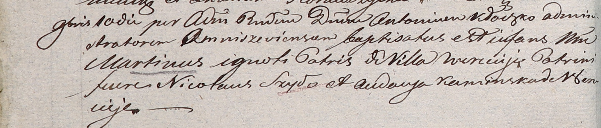

**Мартин (Martin)**

10 ноября 1804 г -- крещение (НИАБ 937-4-32, лист 10об, №25/1804-р).

**НИАБ 937-4-32:** Лист 10об. **Метрическая запись №25/1804-р.**

Дедиловичский костел Наисвятейшего Сердца Иисуса. 10 ноября 1804 года.
Метрическая запись о крещении.

Martin -- сын крестьян с деревни Веретей.

? -- отец.

? -- мать.

Szyło Nicołai -- крестный отец.

Kaminska Audocya -- крестная мать.

Galinowski Joann -- ксёндз, администратор Омнишевского костела.
