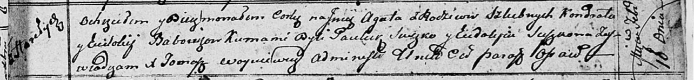

**Бобовик Кондрат (Babowik Kondrat)**

9 ноября 1799 г -- крестный отец Текли (Катерыны), дочери Сушков Грыгора
и Настасьи с деревни Горелое (НИАБ 136-13-938, лист 245, №43/1799-р
(коп)).

8 ноября 1808 г -- свидетель венчания Яна Курнеша с деревни Горелое с
девкой Крыстыной Рандак с деревни Клинники (НИАБ 136-13-920, лист 14об,
№11/1808-б (ориг)).

10 февраля 1813 г -- крещение дочери Агаты (НИАБ 136-13-894, лист 86,
№3/1813-р (ориг)).

**НИАБ 136-13-938:** Лист 245. **Метрическая запись №43/1799-р (коп).**

(См. тж. НИАБ 136-13-894, лист 40, №47/1799-р (ориг); РГИА 823-2-18,
лист 273, №46/1799-р (коп))

{width="6.496527777777778in"
height="1.49375in"}

Дедиловичская Покровская церковь. 6 ноября 1799 года. Метрическая запись
о крещении.

Suszkowna Tekla \[Katerzyna\] Anna -- дочь родителей с деревни Горелое.

Suszko Hryhor -- отец.

Suszkowa Nastazya -- мать.

Bobowka Kondrat -- кум, с деревни Горелое \[Пядань\].

Paciaruchowa Marya - кума,с деревни Горелое.

Jazgunowicz Antoni -- ксёндз.

**НИАБ 136-13-920:** Лист 14об. **Метрическая запись №11/1808-б
(ориг).**

{width="6.496527777777778in"
height="1.8472430008748906in"}

Дедиловичская Покровская церковь. 8 ноября 1808 года. Метрическая запись
о венчании.

Kurnesz Jan -- жених, с деревни Горелое.

Randakowa Krystyna -- невеста, девка, с деревни Клинники.

Szapialewicz Anton -- свидетель, с деревни Домашковичи.

Babowka Kondrat -- свидетель, с деревни Горелое.

Jazgunowicz Antoni -- ксёндз.

**НИАБ 136-13-894:** Лист 86. **Метрическая запись №3/1813-р (ориг).**

{width="6.496527777777778in"
height="0.7590124671916011in"}

Осовская Покровская церковь. 10 февраля 1813 года. Метрическая запись о
крещении.

Babowikowna Agata -- дочь родителей с деревни Горелое.

Babowik Kondrat -- отец.

Babowikowa Eudokija -- мать.

Suszko Pawluk -- кум.

Suszkowa Eudokija -- кума.

Woyniewicz Tomasz -- ксёндз.
