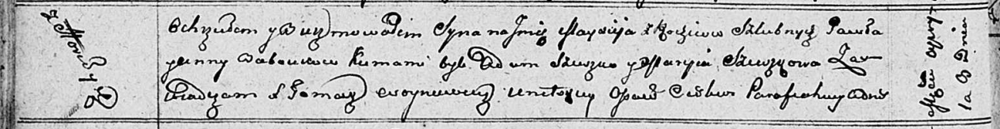

**Бобовик Анна (Babowikowa, Babowkowa Anna)**

12 сентября 1805 г -- крещение дочери Текли Анны (НИАБ 136-13-894, лист
58, №54/1805-р (ориг)).

9 апреля 1811 г -- крещение сына Майсея (НИАБ 136-13-894, лист 80об,
№18/1811-р (ориг)).

**НИАБ 136-13-894:** Лист 58. **Метрическая запись №54/1805-р (ориг).**

{width="6.496527777777778in"
height="1.1981933508311462in"}

Дедиловичская Покровская церковь. 12 ноября 1805 года. Метрическая
запись о крещении.

Babowikowna Tekla Anna -- дочь родителей с деревни Горелое.

Babowik Paweł -- отец.

Babowikowa Anna -- мать.

Suszko Roman -- кум.

Suszkowa Anna -- кума.

Jazgunowicz Antoni -- ксёндз.

**НИАБ 136-13-894:** Лист 80об. **Метрическая запись №18/1811-р
(ориг).**

{width="6.496527777777778in"
height="0.8388024934383203in"}

Осовская Покровская церковь. 9 апреля 1811 года. Метрическая запись о
крещении.

Babowka Maysiey -- сын родителей с деревни Горелое.

Babowka Paweł -- отец.

Babowkowa Anna -- мать.

Szuszko Adam -- кум.

Szuszkowa Maryia -- кума.

Woyniewicz Tomasz -- ксёндз.
